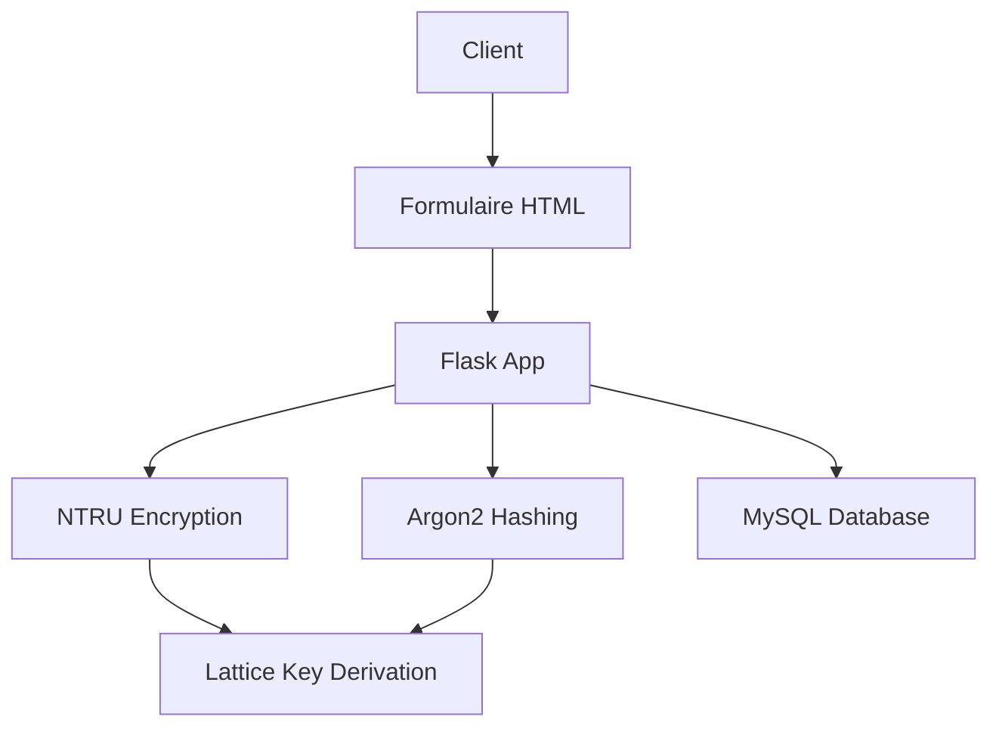

# Authentification Quantique - Système Sécurisé


Une application d'authentification sécurisée utilisant des réseaux de lattices (NTRU) et des techniques cryptographiques post-quantiques.

## 📋 Table des Matières
- [Fonctionnalités](#-fonctionnalités)
- [Architecture Technique](#-architecture-technique)
- [Installation](#-installation)
- [Configuration](#-configuration)
- [Utilisation](#-utilisation)
- [Sécurité](#-sécurité)
- [Structure des Fichiers](#-structure-des-fichiers)
- [Tests](#-tests)
- [Licence](#-licence)

## ✨ Fonctionnalités
- **Inscription sécurisée** avec vérification de mot de passe complexe
- **Connexion protégée** contre les attaques par force brute
- **Chiffrement NTRU** pour le stockage des mots de passe
- **Dérivation de clé** basée sur les réseaux de lattices
- **Verrouillage de compte** après plusieurs tentatives échouées
- **Journalisation détaillée** des événements de sécurité

## 🏗 Architecture Technique


## 🛠 Installation

Installer les dépendances :

```bash
pip install -r requirements.txt
```

Configurer la base de données MySQL via **XAMPP** et **phpMyAdmin** :
1. Lancer XAMPP et démarrer les services **Apache** et **MySQL**.
2. Accéder à phpMyAdmin via `http://localhost/phpmyadmin`.
3. Créer une base de données avec la commande suivante :

```sql
CREATE DATABASE ntru_auth_db;
```

## ⚙ Configuration
Modifier `config.py` selon votre environnement :

```python
class Config:
    MYSQL_HOST = 'localhost'
    MYSQL_USER = 'root'
    MYSQL_PASSWORD = ''
    MYSQL_DB = 'ntru_auth_db'
    NTRU_SCRIPT_PATH = '/chemin/vers/NTRU.py'
    NTRU_KEY_PATH = '/chemin/vers/NTRU_key'
```

## 🚀 Utilisation
Lancer l'application Flask :

```bash
python app.py
```

Accéder à l'application via le navigateur à l'adresse suivante :

```
http://localhost:5000
```

### Flux d'authentification :
**Inscription :**
1. Saisir `username`, `email`, `mot de passe` , `full name` .
2. Le système vérifie la complexité (12 caractères, majuscule, minuscule, chiffre, spécial).
3. Stocke le hash dérivé du réseau de lattice chiffré avec NTRU.

**Connexion :**
1. Vérifie les tentatives échouées.
2. Dérive la clé à partir du mot de passe + lattice.
3. Compare avec le hash stocké (Argon2).

## 🔒 Sécurité
Mesures implémentées :
- Chiffrement AES-GCM pour les composants sensibles.
- Délai aléatoire sur les échecs de connexion.
- Verrouillage après 5 tentatives échouées.
- Protection contre les attaques temporelles.
- Double dérivation de clé (PBKDF2 + SHAKE-256).

### Stack Cryptographique :
- **NTRU** : Algorithmes de chiffrement post-quantique.
- **Argon2** : Algorithme de hachage primé.
- **AES-GCM** : Chiffrement authentifié.
- **SHA3-512** : Fonction de hachage cryptographique.

## 📂 Structure des Fichiers
```plaintext
ntru-auth-app/
├── app.py                        # Application principale Flask
├── config.py                     # Configuration
├── database.py                   # Gestion base de données
├── password_utils.py             # Utilitaires mot de passe
├── hash.py                       # Fonctions cryptographiques
├── templates/
│   ├── login.html                 # Page de connexion
    ├── home.html                  # page d'accueil
    ├── base.html                  # un layout (ou gabarit)
│   └── register.html              # Page d'inscription
├── requirements.txt               # Dépendances
├── NTRU_python-main/              
    ├── examples/                  # Dossier contenant des exemples d'utilisation
    │   ├── A1S1_Tempest/          # Exemple spécifique (fichiers de test)
    │   ├── decoded.dat            # Fichier de message déchiffré
    │   ├── enc.dat                # Fichier de message chiffré  
    │   ├── example.py             # Script d'exemple
    │   ├── NTRU_key.priv          # Clé privée générée
    │   └── NTRU_key.pub           # Clé publique générée
    │
    ├── NTRU/                      # Module principal contenant l'implémentation
    │   ├── __pycache__/           # Cache Python
    │   ├── __init__.py            # Fichier d'initialisation du module
    │   ├── NTRUdecrypt.py         # Classe de déchiffrement (analyse détaillée)
    │   ├── NTRUencrypt.py         # Classe de chiffrement (analyse détaillée)
    │   └── NTRUutil.py            # Fonctions auxiliaires (génération de polynômes, conversions)
    │
    ├── .gitignore                 # Fichier Git ignore
    ├── LICENSE                    # Licence du projet
    ├── NTRU.py                    # Script principal (interface de haut niveau)
    └── README.md                  # Documentation du projet       
└── auth_security.log              # Journal sécurité
```

## 🧪 Tests
Exécuter les tests NTRU :

```bash
python test_ntru.py
```

Exemple de sortie :

```plaintext
=== Test complet ===
Salt: MLUFGYU5eT...
Lattice: Xt3agM9FKM...

[NTRU]
Original: $argon2id$v=19$m=262144,t=4,p=8$...
Déchiffré: $argon2id$v=19$m=262144,t=4,p=8$...
Match: True

[Dérivation]
Match: True
```

## 📜 Licence
Ce projet est sous licence MIT.